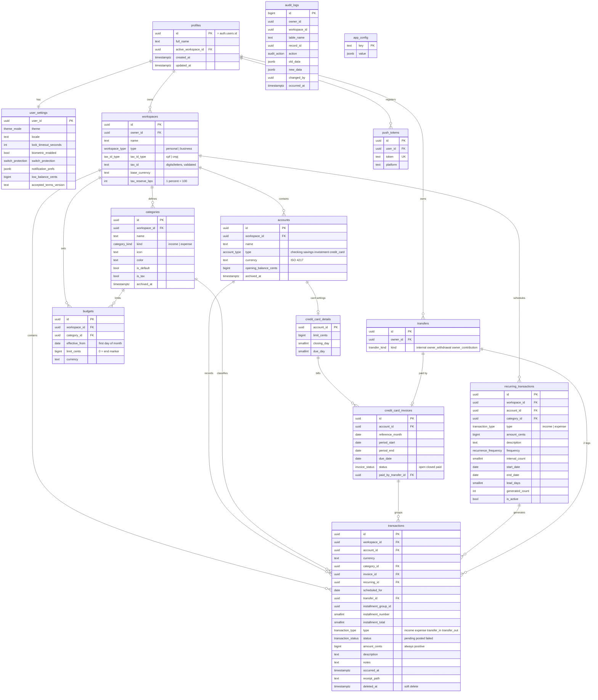

# Finly - Database

The SQL under `sql/` is the **source of truth**. This file explains it and must not contradict it. It replaces the old `database.md` (5-table draft).

## 1. How to apply

| Order | File | Purpose |
|---|---|---|
| 0 | `99_reset_dev.sql` | *Dev only.* Wipes our objects so you can start clean (keeps `auth.users`). |
| 1 | `00_types.sql` | Enums |
| 2 | `01_helpers.sql` | Private schema, CPF/CNPJ validators, date helpers (`private.local_date`) |
| 3 | `02_tables.sql` | Tables, constraints, indexes, `app_config` seed |
| 4 | `03_logic.sql` | Triggers, views, RPC functions |
| 5 | `04_security.sql` | RLS policies and grants |
| 6 | `05_storage.sql` | Receipts bucket and its policies (Supabase only) |
| 7 | `06_jobs.sql` | Reference template of the daily jobs, superseded by `10` (kept for history) |
| 8 | `07_hardening.sql` | Pins `search_path` on helper functions (Supabase security advisor) |
| 9 | `08_credit_card.sql` | `create_credit_card`: card account and settings in one operation |
| 10 | `09_budget_end_marker.sql` | Allows a budget limit of 0 (an end marker) |
| 11 | `10_schedule_jobs.sql` | Schedules the two daily jobs with `pg_cron` (**Supabase only**) |
| 12 | `11_monthly_flow.sql` | View `monthly_flow` for the dashboard chart |
| 13 | `12_recurring_edit_delete.sql` | `update_recurring`, `delete_recurring` |
| 14 | `13_schedule_purge.sql` | Schedules the daily purge of the trash with `pg_cron` (**Supabase only**) |
| 15 | `14_restore_transfer.sql` | `restore_transfer`: brings a deleted transfer back |
| 16 | `15_move_transaction.sql` | `move_transaction`: moves an income or an expense to another account; the transactions guard lets only this function change the account |

The Supabase project `Finly` (region sa-east-1) has `00` to `05`, `07` to `16` applied. Run a file in the Supabase **SQL Editor** (or as a migration), once, in order. Keep every change in git: never edit tables by hand in the dashboard without copying the change back into `sql/`.

Verify locally without Docker or Supabase (CI runs the same on every pull request):

```bash
pip install pgserver "psycopg[binary]"
python sql/tests/run_db_tests.py        # 126 checks (applies 00-04, 07-09, 11, 12, 14, 15, 16)
```

`sql/tests/00_mock_supabase.sql` only fakes `auth.users` and `auth.uid()` for that test. Never run it in Supabase. Files `10` and `13` need `pg_cron`, which only Supabase has, so the test does not apply them (it does test `private.purge_deleted()` and `restore_transfer`). On Windows the embedded Postgres has no time zone database, so run these tests in CI (or copy the `tzdata` files into the virtual environment).

## 2. Entity-relationship diagram



`audit_logs` is filled by triggers on workspaces, accounts, transactions, categories, budgets and recurring_transactions; it has no foreign keys on purpose (it is erased only by `delete_my_account()`).

## 3. What changed from the earlier draft

| Before | Now | Why |
|---|---|---|
| `password_hash` in users | removed; `profiles.id = auth.users.id` | Supabase Auth owns passwords |
| `balance_cents` on accounts | `opening_balance_cents` + derived view | no drift, no races |
| `tax_reserve_pct` float | `tax_reserve_bps` integer | no floats |
| `transfer_in` / `transfer_out` rows unrelated | two legs linked by `transfers.id` | integrity + audit |
| `type: credit` | `credit_card` | clearer |
| negative amounts for expenses | amounts always positive | direction lives in `type` |
| `CONFIRMED` | `posted` | single vocabulary with the SRS |
| `tyoe`, `tranfer_out` typos | fixed | script now runs |
| weak `auth.role() = 'authenticated'` policies | owner-chained policies | the earlier ones exposed all data |
| `invoice.total_cents` stored | `invoice_totals` view | derived, cannot go stale |

## 4. Security model

- RLS is on for **every** table. Access is decided by `is_workspace_member(workspace_id)` (today: workspace owner) or `owns_account(account_id)`.
- Anonymous users can read only `app_config` (needed for the force-update check).
- Clients cannot: insert workspaces (use `create_workspace`), insert transfer legs (use `create_transfer`), write or delete audit rows, hard-delete transactions, change a workspace's type or tax ID.
- Privileges are explicit (`04_security.sql` revokes everything first, then grants the minimum). Column-level grants limit which fields clients may update. Views are `security_invoker` (RLS of the underlying table applies) and granted to `authenticated` only.
- Internal functions live in schema `private`, which the API does not expose. Public RPCs are `SECURITY DEFINER`, set `search_path`, check `auth.uid()` and membership themselves, and are revoked from `public` and `anon`.
- The Supabase security advisor lists the RPCs as callable by signed-in users (intended: each one checks who is calling) and the tables as visible in the GraphQL schema (protected by RLS). Both are tracked in `POLISH.md`.

## 5. RPC functions, views and jobs

| Name | Purpose |
|---|---|
| `create_workspace(name, type, tax_id)` | Validates tax ID, enforces one per type, seeds default categories, sets active workspace |
| `switch_workspace(workspace_id)` | Ownership check, stores active workspace |
| `create_transfer(from, to, amount, description, occurred_at, kind, to_amount, status)` | Two legs; enforces kind rules and currency rules |
| `delete_transfer(transfer_id)` | Soft-deletes both legs; reopens an invoice this transfer had paid |
| `move_transaction(transaction_id, account_id)` | Moves an income or an expense to another account of the same workspace and currency. An expense of a bank account can also go to a credit card (a purchase on the invoice of its date, refused when that invoice is paid), and a card purchase can come back to a bank account while its invoice is not paid. Refused for a deleted transaction, a transfer leg, an installment, the same account, an archived account, another workspace or currency, an income going to a card, a card purchase going to another card, and anyone who is not a member |
| `restore_transfer(transfer_id)` | Brings a deleted transfer back, both legs together. Refused when the transfer touches a credit card (an invoice payment: the invoice has to be paid again), when it is not deleted, and for anyone but its owner |
| `create_credit_card(workspace, name, currency, limit, closing_day, due_day)` | Creates the card account and its settings in one operation; opening balance 0 |
| `create_installments(account, category, total, n, description, purchase_at)` | N charges on consecutive invoices; remainder to the first |
| `pay_invoice(invoice, from_account, paid_at)` | Creates the payment transfer and marks the invoice paid |
| `generate_my_recurring(until)` | Creates pending occurrences (default 35 days ahead), idempotent |
| `update_recurring(id, description, amount, category, end_date)` | Changes the item; pending occurrences from today on follow the new values; pending ones after a new end date are soft-deleted. Never touches the schedule |
| `delete_recurring(id)` | Soft-deletes pending occurrences, detaches the confirmed ones (history stays), deletes the item |
| `delete_my_account()` | Erases the user's data, audit trail and auth record |
| `is_valid_cpf(text)`, `is_valid_cnpj(text)` | Check-digit validators (CNPJ accepts letters) |
| view `account_balances` | posted and projected balance per account |
| view `invoice_totals` | invoice total per invoice |
| view `monthly_category_spend` | spent per category per month (America/Sao_Paulo; pending counts, like in budgets) |
| view `monthly_flow` | posted income and expenses per workspace, currency and month (America/Sao_Paulo); transfers excluded |

Private jobs: `close_due_invoices` and `generate_all_recurring` are scheduled by `10_schedule_jobs.sql` with `pg_cron` at 03:05 and 03:15 UTC (00:05 and 00:15 in Sao Paulo); `purge_deleted` (removes for good what was soft-deleted more than 30 days ago, and the transfers left with no legs) is scheduled by `13_schedule_purge.sql` at 03:25 UTC. Check them with `select * from cron.job_run_details order by start_time desc limit 10;`.

Stable error keys the app maps (see ARCHITECTURE section 5): `invalid_tax_id`, `workspace_type_already_exists`, `forbidden`, `not authenticated`, `invoice already paid`, `invalid status change`, `category kind does not match transaction type`, `transfer legs are managed through ...`.

## 6. Business rules enforced in the database

| Rule | How |
|---|---|
| One Personal and one Business per user; Personal=CPF, Business=CNPJ | unique `(owner_id, type)` + check constraints |
| Valid CPF/CNPJ (incl. alphanumeric CNPJ) | `CHECK` calling the validators |
| Type and tax ID immutable | trigger |
| Account, workspace and currency agree on every transaction | composite foreign key `(account_id, workspace_id, currency)` |
| Category kind matches transaction type | trigger (and a check inside `update_recurring`) |
| The account of a transaction changes only through `move_transaction` | the guard trigger refuses a direct change; the function switches `finly.rpc` on for its own update |
| A goal follows one account that is not a credit card, of the same workspace and currency; its name is unique among the active goals | composite foreign key, `goals_guard` trigger and a partial unique index |
| Budgets only for expense categories | composite foreign key on `category_kind` |
| A budget version with limit 0 means "no budget from this month on" | `CHECK (limit_cents >= 0)` (file 09) |
| Only a credit-card account can have card details | foreign key `(account_id, 'credit_card')` |
| Two active accounts cannot share a name; archived ones do not count | partial unique index |
| Charges attach to the correct invoice; paid invoice locks its charges | trigger |
| Transfer legs managed only through functions | RLS + trigger |
| Status changes: posted and failed never jump to each other | trigger |
| Recurring generation never duplicates | unique `(recurring_id, scheduled_for)` |
| `recurring_id` and `scheduled_for` are set or cleared together | `CHECK tx_recurring_shape` |
| A recurring item that has history cannot be hard-deleted | foreign key without cascade; `delete_recurring` detaches the history first |
| Audit is append-only | trigger (bypassed only by account erasure) |
| Deleted rows stay readable by their owner and are removed after 30 days | soft delete (`deleted_at`) + the daily purge job |
| Only the owner can restore a transfer, and never an invoice payment | checks inside `restore_transfer` |

### Known behavior worth remembering

- If an end date removes pending occurrences and the end date is later cleared, those occurrences do **not** come back: `generated_count` already moved past them and the unique index still holds their dates, so the series continues after the gap. Tracked in `POLISH.md`.
- Editing a recurring item never changes occurrences that are already confirmed or overdue.
- `lead_days` on a recurring item is how many days before the due date the app announces its pending occurrences (3 by default); the reminders read it through the foreign key `transactions.recurring_id`.
- `workspaces.tax_reserve_bps` is the share of the income a company sets aside for taxes, in basis points (650 = 6.5%); only a business workspace can have a value above zero (a check of the table). The app reads it with the posted income of `monthly_flow` and the spending of the categories with `is_tax` (the default "Impostos") in `monthly_category_spend`.
- `user_settings.notification_prefs` is a JSON object; the app uses `bill_reminder` and `card_due` and keeps every other key as it is (`budget_alert`, `low_balance`, `pending_digest` are reserved for later).

## 7. What stays in the app (not in the database)

Password policy, the session lock and its brute-force counter, switch protection prompts, the scheduling of reminders, the alerts card, CSV export, forecast, yield and tax-reserve calculations *(planned)*, OCR parsing *(planned)*, OFX parsing *(planned)*, PDF export *(planned)*, the 10-second undo, chart drawing and all display formatting. The app only stores the **settings** of these in `user_settings`.

## 8. Mapping to Dart enums

Postgres enum labels equal Dart enum names, so `Enum.values.byName(value)` works both ways: `WorkspaceType {personal, business}`, `TaxIdType {cpf, cnpj}`, `AccountType {checking, savings, investment, credit_card}` (Dart: `creditCard` needs an explicit map, since `byName` is case-sensitive: use a small `fromDb/toDb` extension for that one), `TransactionType`, `TransactionStatus`, `CategoryKind`, `InvoiceStatus`, `RecurrenceFrequency`, `TransferKind`, `SwitchProtection`, `ThemeMode`.